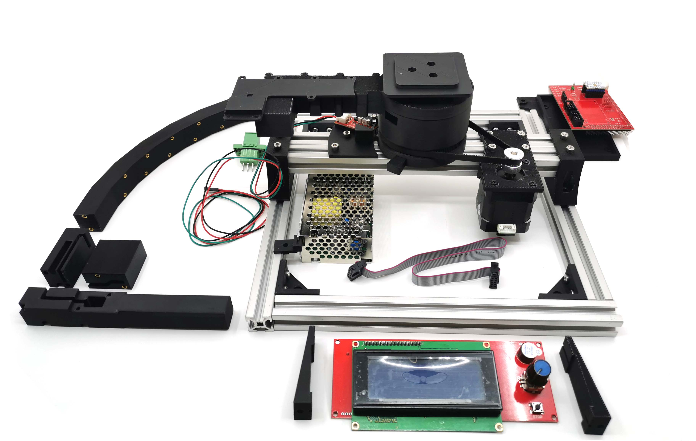

+++
title = "Introduction"
date = 2023-02-25T07:26:14+01:00
weight = 1
chapter = true
+++
# HASOR
### Handheld Acquisition System Open RTI

<video width=100% autoplay loop>
    <source src="RTI_global_4_LQ_400x464_256b.mp4" type="video/webm">
    Your browser does not support the video tag.  
</video>

HASOR est un dispositif open-source de prise de vue photographique **RTI** ("Reflectance Transformation Imaging") de petits objets.
Il a été conçus pour la **prise de vue d'objet de petite taille**, ayant un diamètre d'**environ 10 cm**. Une fourche mobile pourvue de 6 sources lunmineuses hautes intensités se deplace automatiquement autour de l'objet à étudier et permet de simuler l'utilisation d'un dôme de leds. L'appareil photo de l'utilisateur, placé sur un trepied en surplomb du dispositif est declanché de manière synchronisé par l'intermediaire de sa prise **trigger** ou d'un signal IR.

Ce systeme à été pensé de façon à être reproduit avec les outils disponibles dans les FabLabs (imprimante 3D, découpeuse laser) et à partir du maximum de materiaux "standards".
Une liste de matériel et de fournisseurs, les plans mécaniques, les schemas électronique ainsi que les codes sources sont mis en ligne sous licence "xxxxxxx" afin de permettre à chacun de répliquer et adapter le dispositif.
Il sera également disponible sous forme de **Kit** ou **préassemblé** dans notre section **"Boutique"** pour les utilisateurs souhaitant un systeme clef en main.

Les avantages de notre solution de bras mobile sont multiples:

- Réduction significative du nombre de leds par rapport à un systeme de dôme
- Une simplification de l'électronique de controle et du cablage des sources lumineuses
- La fourche est amovible afin de faciliter le transport et le stockage du dispositif
- Un encombrement reduit, l'ensemble pouvant être contenu dans une malette de *35x35x15cm*
- Controle des parametres d'acquisition simple grâce à l'interface utilisateur integrée

