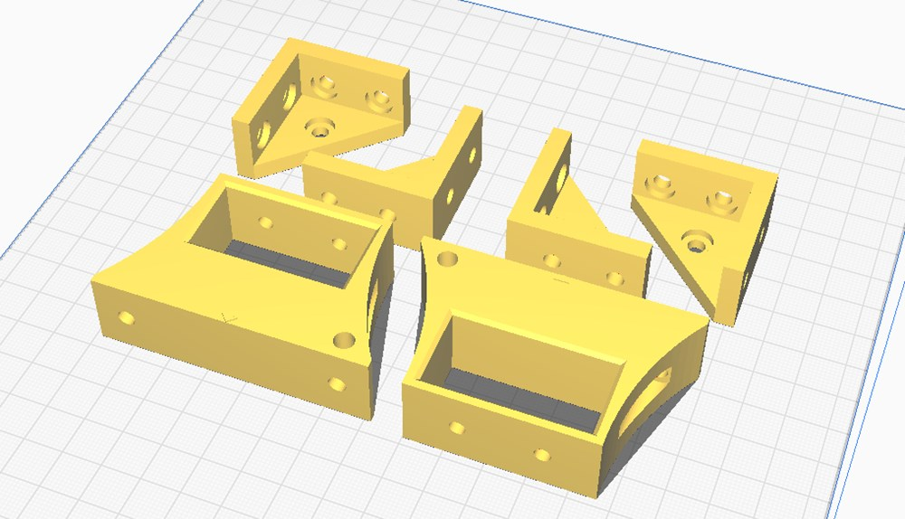
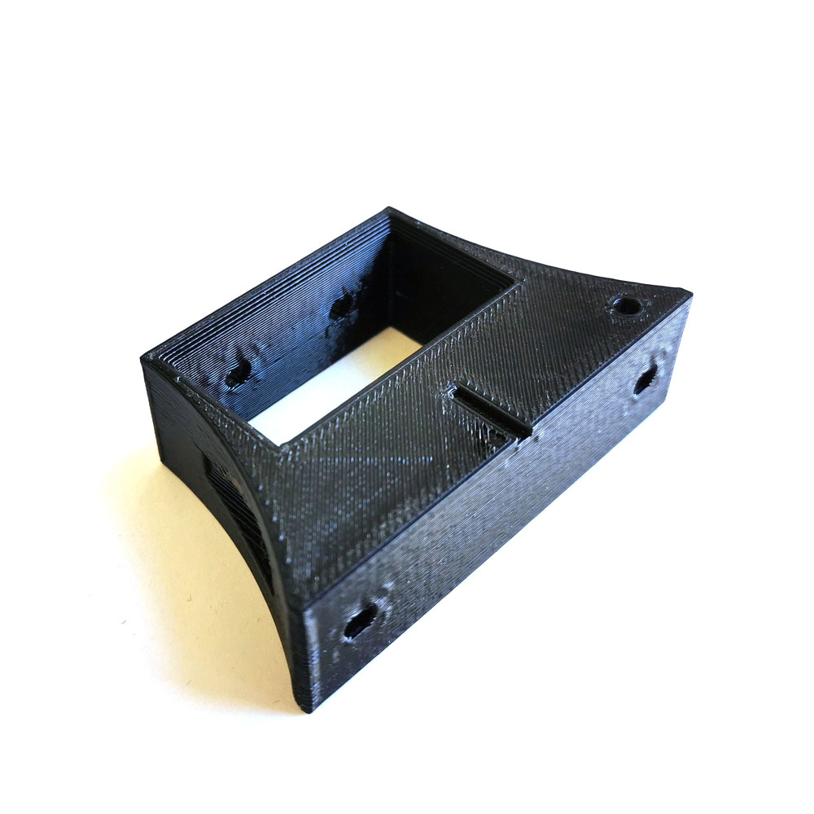
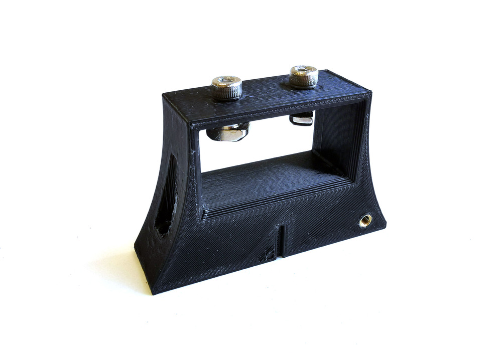
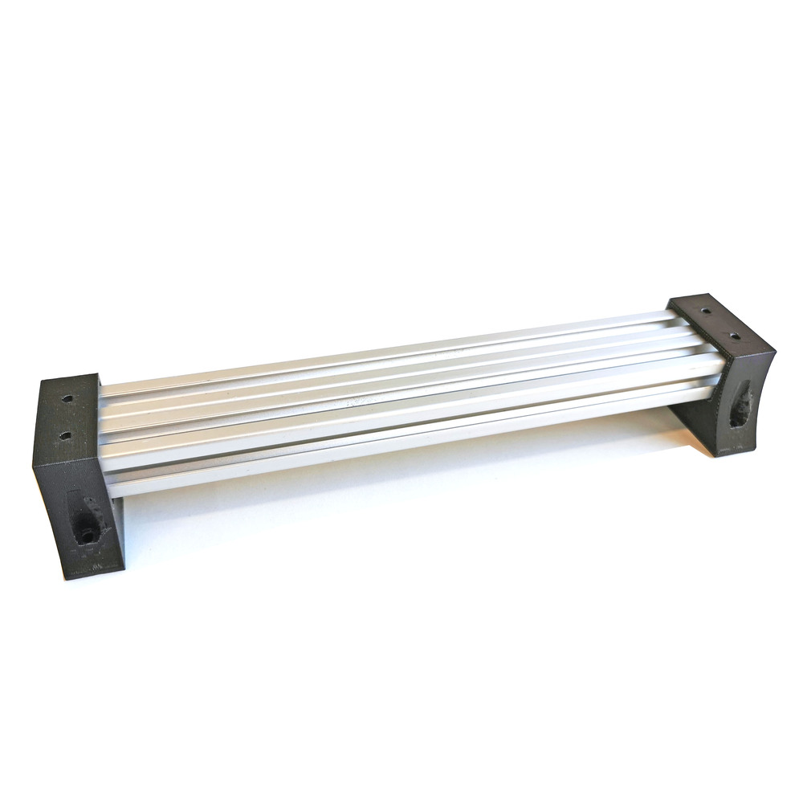
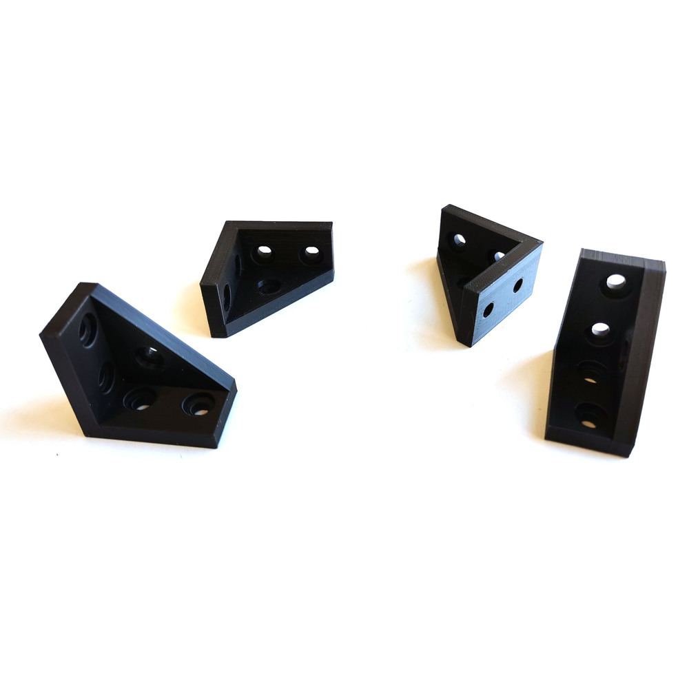

The mechanisms and all components of the instruments rely on a structure made of **20x20mm section extruded aluminium bars** (*Bosch Rexroth ref. 3842992888/3000*).

It is composed by:

- 2x **280mm** bar
- 4x **260mm** bar

Those bars are connected together with 3D printed parts.

