+++
title = "Graphical user interface"
date = 2023-02-25T07:26:45+01:00
weight = 1
chapter = false
+++

### Menu structure

You can find a pdf version of the document describing the user interface here (in french only for now).
{}

## START:
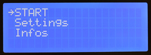 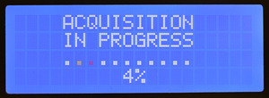

Start acquisition sequence. Pressing the cursor during acquisition cancels the current sequence.
## Infos:
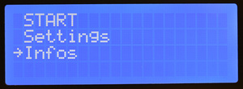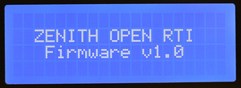
Display firmware version.
## Settings:
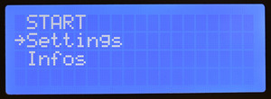
Adjust settings related to exposure time, camera triggering, motor steps, illumination duration, etc.
### Motor:
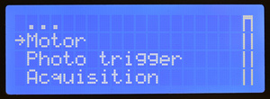
#### Stab. delay:
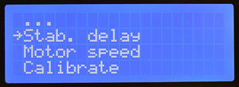
Delay for stabilizing the fork. Wait time before the first shot after the fork reaches its position. Increasing this delay avoids potential blur effects on the first shot induced by system vibration at the end of movement. Recommended value minimum 50ms.
#### Motor speed:
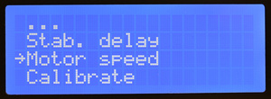
Maximum motor movement speed in steps/s.
#### Calibrate:
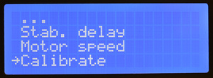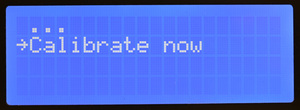
"Calibrate now" starts the motor calibration process, searching for the end-of-travel contact to reset the motor step counter.
### Acquisition:
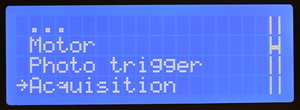
The fork position is given on a scale from **0 to 1**.
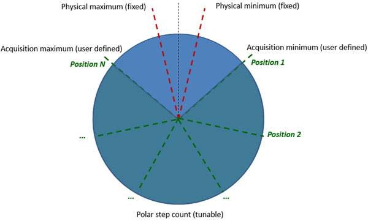
**Position 0** represents the **minimum position** determined by calibration (end-of-travel sensor position), and **position 1 represents the maximum** motor position.
#### Steps count:
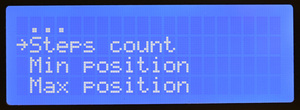
Number of polar positions for measurement.
#### Min position:
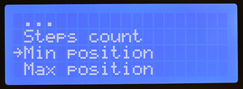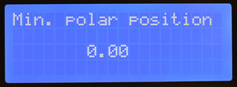
First polar position of the fork.
#### Max position:
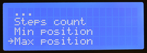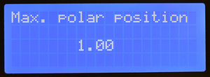
Last polar position of the fork.
### Photo Trigger:
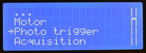
#### Shutter type:
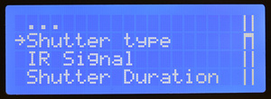
Trigger type, by dry contact with internal relay (relay) or by infrared signal (IR).
### IR Signal:
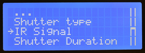
#### Predefined:
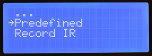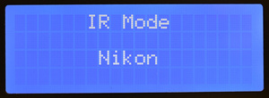
Choose the trigger signal from commonly used camera brands. Choose "custom" to use your own signal.
#### Record IR:
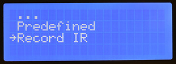
Record your own signal from the camera's original remote (feature not implemented yet, require to add an IR sensor to Hasor arduino shield)
### Shutter Duration:
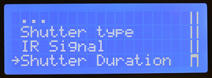
Duration of dry contact for camera triggering via relay (sync cable). Adjust according to the camera.
### Snaps delay:
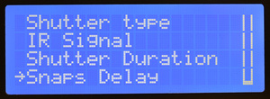
Minimum time between two shots.
## Leds:
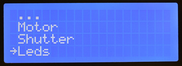
Section for adjusting LEDs parameters.
### Modules count:
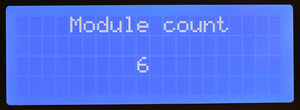
Number of LED modules. 6 by default.
### Leds by module:
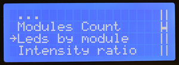
Number of LEDs per module. Set to 3 in the case of RGB LED modules on LED modules.
### Tune intensities:
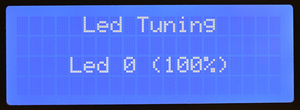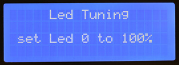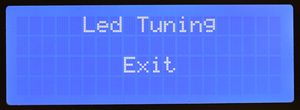
Adjust LED intensity by module. Turn the knob to select led number 0 to MAX_LED. Pushing the knob let you enter into setting mode. Turn the knob to set new intensity (in percent of the max intensity defined into related section). Push again to validate. To exit led tuning menu, rotate knob until showing "Exit" and push to validate. 
### LedOn duration:
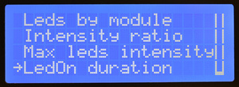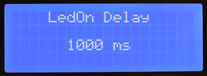
Duration of LED triggering, adjust to be at least equal to the camera's exposure time.
## Tests:
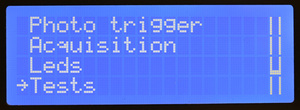
Section for testing LEDs, camera triggering, or motor movement.
### Motor:
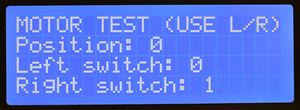
Turn the cursor to move the fork and check the status of the end-of-travel sensor(s). Click to return to the previous menu.
### Shutter:
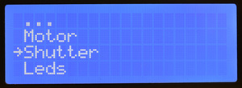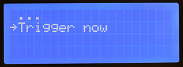
**"Trigger now"** triggers the camera with the settings defined in "settings" section.
### Leds:
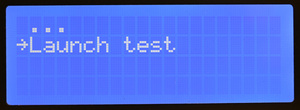
**"Launch test"** triggers a sequential lighting **test of all LEDs**.
## Save:
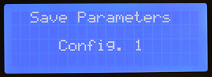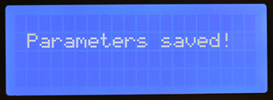
Save the settings previously defined by the user (min/max position, steps count, etc.) in one of the available memory slots. Click on the **configuration name** to save or **"Cancel"** to return to the previous menu.
## Load:
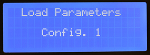
Load the settings previously **saved by the user**. Click on the **configuration name** to load or **"Cancel"** to return to the previous menu.