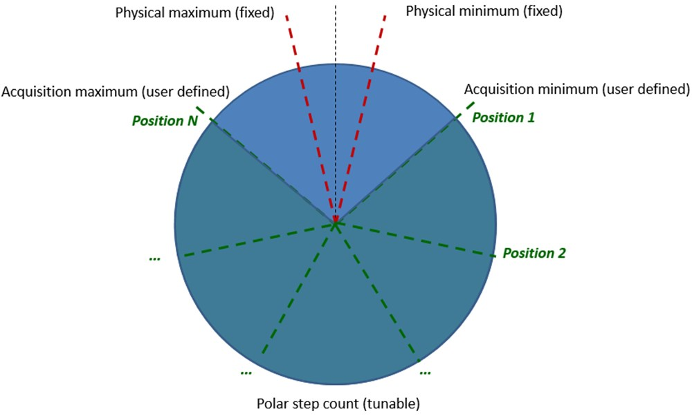

+++
title = "How it works"
date = 2023-02-25T07:26:45+01:00
weight = 2
chapter = true
+++

### How it works

# Graphical user interface

You can find a pdf version of the document describing the user interface here (in french only for now).
{}

# Photo trigger
Put your camera above HASOR (on a tripod for exemple), and connect it to the trigger connector them with a cable (see connections section for details).
If supported by your camera, it can be triggered throught infrared signal after setting your camera model on the related section of the HASOR menu.

# Description
Select START on the menu, click on the knob to begin the acquisition process. The harm will move to it initial position and start the lighting/camera shoot sequence. You can abort the sequence clicking a second time on the Knob.
The harm will stop and shoot on the number of positions defined by the user. Then it come back to the home position automaticaly.

