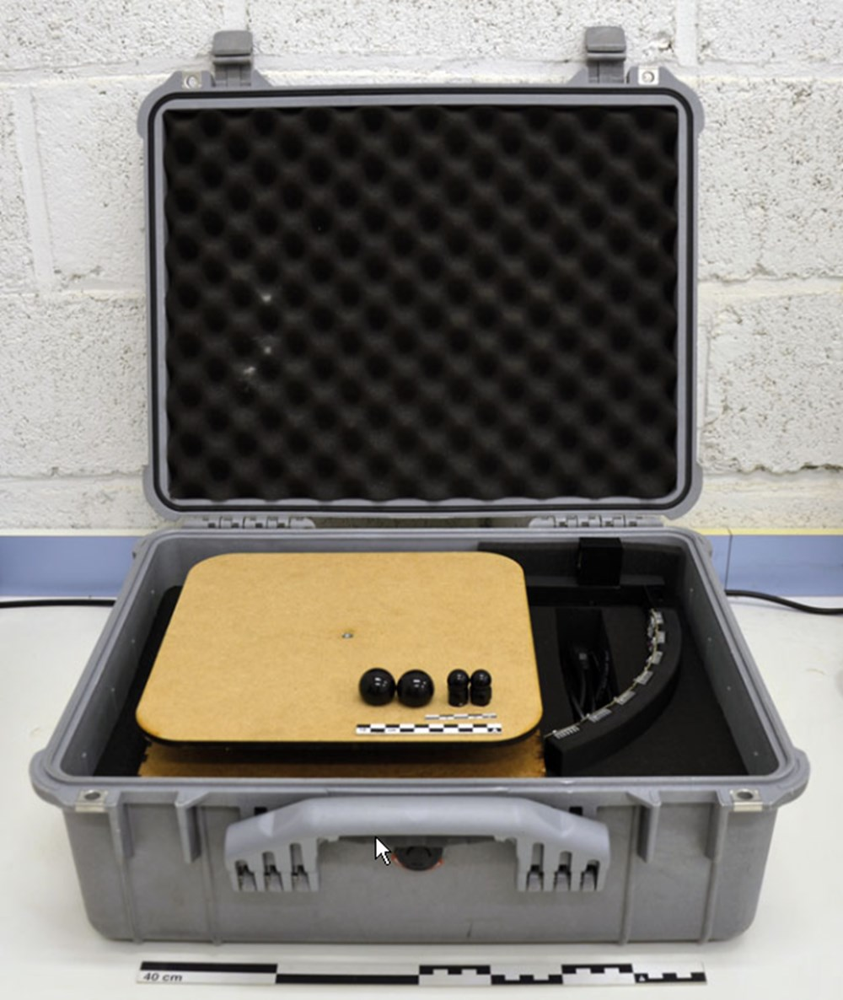

+++
title = "Introduction"
date = 2023-02-25T07:26:14+01:00
weight = 1
chapter = true
+++

# HASOR
### Handheld Acquisition System Open RTI

**HASOR** is an open-source device for **Reflectance Transformation Imaging (RTI)** photographic capture of **small objects**. It is designed for capturing objects of diameter up to approximately 10cm. A movable fork equipped with 6 high-intensity light sources automatically moves around the object being studied and simulates the use of a dome of LEDs. The user's camera, placed on a tripod overlooking the device, is triggered synchronously through its trigger port or an IR signal.

This system is designed to be reproduced with tools available in FabLabs (3D printers, laser cutters) and using as many "standard" materials as possible. A list of materials and suppliers, mechanical plans, electronic diagrams, and source codes are posted online under open-source license to allow anyone to **replicate and adapt** the device. It will also be available as **kit** form or **pre-assembled** in our "Shop" section for users who want a turnkey system.

Files are available here: 
{}HASOR Files{}

The advantages of our mobile arm solution are numerous:

- Significant reduction in the number of LEDs compared to a dome system
- Simplification of control electronics and wiring of light sources
- The fork is removable to facilitate transport and storage of the device
- Compact size, with the entire device fitting into a 35x35x15cm case
- Simple acquisition parameter control through the integrated user interface

